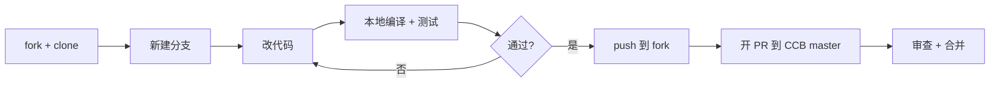
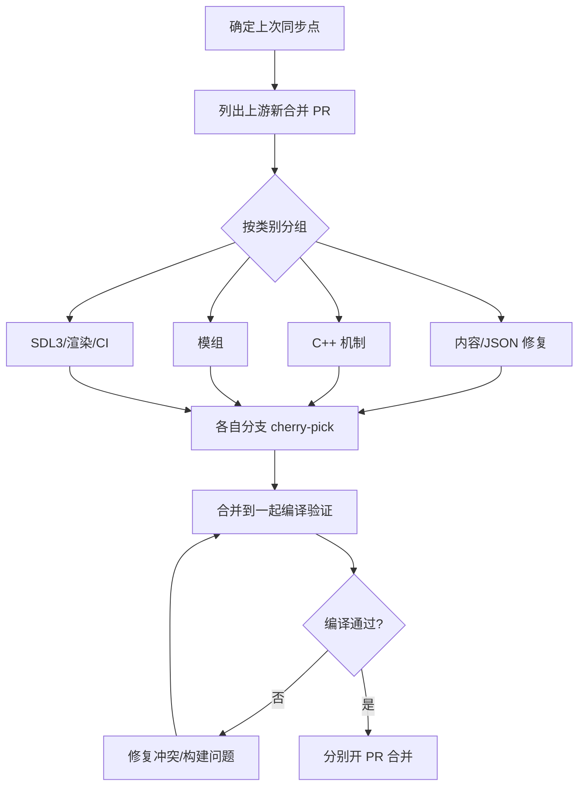

# 代码贡献

面向想修 bug、加功能、或帮忙同步上游 CDDA 的开发者。

## 准备工作

1. 在 GitHub 上 fork [Cataclysm-Cleanwater-Bomb](https://github.com/LYHGLYTX/Cataclysm-Cleanwater-Bomb)
2. clone 你的 fork 到本地
3. 能从源码编译游戏（见[编译游戏](/docs/dev/build)）

## 工作流



## 分支与提交规范

- **分支命名**：按内容类别，例如 `fix/vehicle-crash`、`feat/tileset-coverage`、`sync-cdda-cpp`
- **不直接推 master**：永远在新分支上工作
- **提交信息**：简洁说明做了什么，一行概括 + 必要时正文展开
- **PR 标题**：说明修复内容或同步范围
- **PR 描述**：列出改动点、验证情况（是否编译通过、是否跑了测试）

## 同步上游 CDDA

CCB 定期从 [CleverRaven/Cataclysm-DDA](https://github.com/CleverRaven/Cataclysm-DDA) 同步已合并的 PR。典型做法是**按类别分支 cherry-pick**，便于分批审查：



## 处理合并冲突

当多个分支改了同一文件，先合无冲突的分支，再 rebase 有冲突的分支到最新 master：

```bash
git checkout <冲突分支>
git rebase origin/master
# 解决冲突后
git add <冲突文件>
git rebase --continue
git push --force-with-lease origin <冲突分支>
```

解决冲突时以**上游权威态**为准，除非 CCB 有意保留自有改动。

## 编译验证

合并前务必本地编译通过（见[编译游戏](/docs/dev/build)）。JSON 数据改动也要通过校验，避免格式错误导致游戏加载失败：

```bash
# JSON 格式化与校验
python3 tools/format/format.py
```

:::tip
不确定改动是否合适？先到[开发贡献 QQ 群](/community)问一声，避免白做工。
:::
