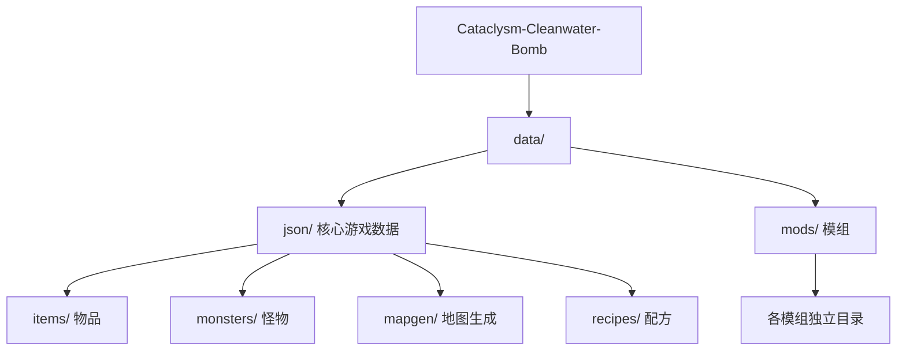
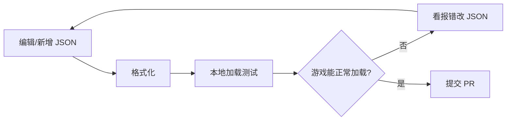

# 内容 / 模组贡献

CCB 的绝大部分游戏内容（物品、怪物、配方、地图、任务……）都是 **JSON 数据**，不需要写 C++ 就能改。这是最容易上手的贡献方式。

## 数据放在哪



| 路径 | 内容 |
|---|---|
| `data/json/` | 核心游戏数据（默认加载） |
| `data/mods/` | 模组（玩家可选开启，CCB 自带 50+ 个） |

改核心内容就编辑 `data/json/`；做独立的新内容建议放进 `data/mods/` 下的模组，不影响主线。

## JSON 基础

CDDA 的 JSON 对象都有 `type` 和 `id`。举个最简单的物品例子：

```json
{
  "type": "GENERIC",
  "id": "example_rock",
  "name": { "str": "石头" },
  "description": "一块普通的石头。",
  "weight": "200 g",
  "volume": "250 ml",
  "material": [ "stone" ],
  "symbol": "*",
  "color": "dark_gray"
}
```

几个要点：

- **`id` 唯一且永不翻译**：是游戏内部标识，全局唯一。
- **`name` / `description` 可翻译**：展示给玩家的文本，会进翻译系统。
- **可以继承**：用 `"copy-from": "另一个id"` 复用已有定义，只写差异字段，避免重复。

## 常见内容类型

| `type` | 是什么 |
|---|---|
| `GENERIC` / `TOOL` / `ARMOR` / `GUN` | 各类物品 |
| `MONSTER` | 怪物 |
| `recipe` | 制作配方 |
| `mapgen` | 地图生成（建筑、房间布局） |
| `terrain` / `furniture` | 地形与家具 |
| `talk_topic` / `mission_definition` | NPC 对话与任务 |

## 工作流



### 1. 格式化

CDDA 对 JSON 格式有统一要求，提交前跑格式化工具：

```bash
python3 tools/format/format.py
```

### 2. 本地测试

启动游戏，新建存档加载，确认你的内容能正常出现、没有报错。做模组的话在新建游戏时勾选你的模组。

### 3. 校验

游戏启动时会校验所有 JSON，加载日志里若有红色报错说明数据有问题（缺字段、引用了不存在的 id 等），按提示修正。

## 想做模组？

参考 `data/mods/` 下现有模组的结构：每个模组有 `modinfo.json`（声明模组元信息）+ 内容 JSON。照着改是最快的学习方式。

:::tip
不确定某个字段怎么用？CDDA 官方的 [JSON 文档](https://github.com/CleverRaven/Cataclysm-DDA/tree/master/doc) 是最权威的参考，CCB 的数据格式与上游基本一致。
:::
