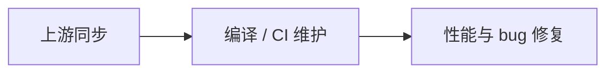
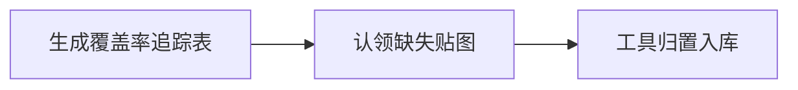
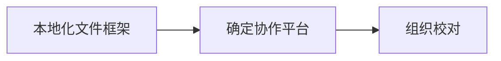

# 贡献指南

CCB 是一个社区驱动的项目，欢迎任何形式的贡献。不管你会不会写代码，都有适合你的参与方式。

## 三条线总览

### 开发线

### 贴图线

### 翻译线

| 线索 | 适合谁 | 入口 |
|---|---|---|
| **[开发线](./code)** | 会 C++ / 想修 bug / 同步上游 | GitHub PR |
| **[贴图线](./tileset)** | 会画像素图 / 美术 | 贴图追踪表 + 归置工具 |
| **[翻译线](./translation)** | 懂中英文 / 愿意校对 | 本地化文件 + Transifex |

## 通用约定

无论哪种贡献，都遵循这几条：

- **不直接推 master**：永远在新分支上工作，通过 PR 合并
- **改动聚焦**：一个 PR 只做一件事，方便审查
- **本地验证**：代码要能编译，JSON 要能通过校验，提交前自己先测一遍
- **说明清楚**：PR 描述写清楚改了什么、为什么、怎么验证的

## 找人交流

遇到问题不要憋着，到[社区](/community)找人问：QQ 群、Discord、Reddit 都有人。贴图和开发各有专门的 QQ 群。
