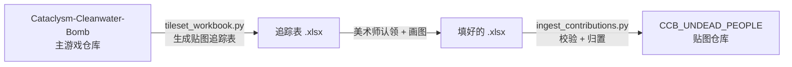
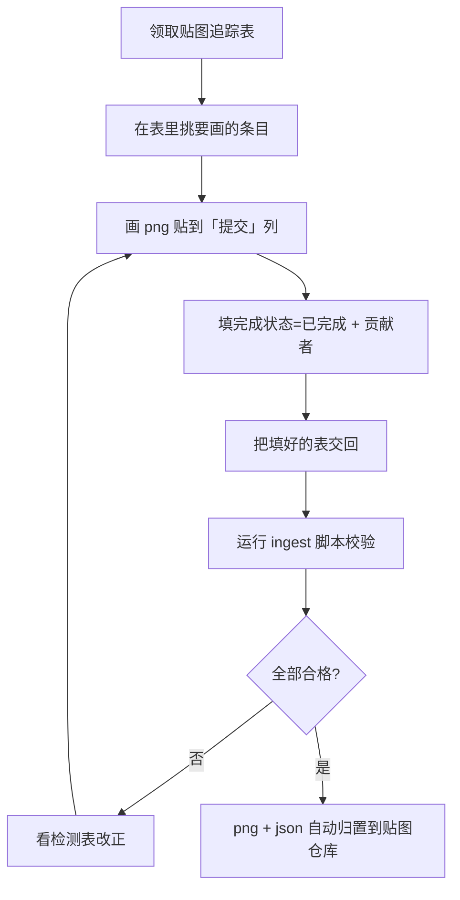

# 贴图贡献

CCB 使用 UNDEAD_PEOPLE 贴图包。如果你会画像素图，可以认领缺失的贴图并贡献进来。整个流程有工具支持，你只需要专注画图。

## 涉及的两个仓库

贴图贡献横跨两个仓库，先理清关系：



| 仓库 | 作用 | 关键脚本 |
|---|---|---|
| **Cataclysm-Cleanwater-Bomb** | 主游戏，定义有哪些 ID 需要贴图 | `tools/gfx_tools/tileset_workbook.py`（生成追踪表）<br/>`tools/gfx_tools/tileset_coverage.py`（统计覆盖率） |
| **CCB_UNDEAD_PEOPLE** | 贴图素材仓库，png + json 存放地 | `tools/gfx_tools/ingest_contributions.py`（归置贡献） |

## 完整流程



### 1. 领取追踪表

维护者用 `tileset_workbook.py` 生成一份多工作表的 Excel 追踪表，按类别分工作表（物品、怪物、地形、家具、载具部件、地图事件……），每行一个需要贴图的游戏 ID。表里标了哪些「缺失」需要画。

### 2. 画图并填表

每一行你要做三件事：

| 列 | 怎么填 |
|---|---|
| **提交** | 把画好的 png **图片直接贴进这个单元格**（内嵌图片） |
| **完成状态** | 改成 `已完成` |
| **贡献者** | 填你的名字 / ID |

:::warning[常见错误]
- **贴错行**：图片要贴在目标条目**那一行**的「提交」列，不要贴在表头或空白处。脚本按图片左上角锚定的行来匹配条目。
- **填错列**：贡献者填在「贡献者」列，不是「提交」列。
- **尺寸不符**：png 像素尺寸必须是贴图包已定义的尺寸（如 32×32），否则判不合格。
:::

### 3. 归置入库

填好的表交回后，在 **CCB_UNDEAD_PEOPLE 仓库**运行归置脚本：

```bash
cd CCB_UNDEAD_PEOPLE
# 普通归置（新增贴图）
python3 tools/gfx_tools/ingest_contributions.py 填好的表.xlsx --repo .

# 想先看检测结果不落地
python3 tools/gfx_tools/ingest_contributions.py 填好的表.xlsx --repo . --dry-run

# 替换官方已有贴图（原位覆盖，被覆盖的原图备份进检测表）
python3 tools/gfx_tools/ingest_contributions.py 填好的表.xlsx --repo . --replace
```

## 合格判定

每个带图的行必须**同时满足**三条才合格：

1. 完成状态 == `已完成`
2. 贡献者非空
3. png 像素尺寸在贴图包已定义的尺寸集合内（读 `tile_info.json`）

:::info[全合格才归置]
只要有**任何一行**不合格，整张表**整体不归置**，只输出检测表告诉你哪里有问题。改正后重新跑即可。这是为了避免半成品混入仓库。
:::

## 归置规则

脚本按「工作表类别 + png 尺寸」决定图片放到哪个目录：

- **怪物 / 尸体** → 角色图集（`pngs_ChibiNormal_<尺寸>/monster/`）
- **物品 / 地形 / 家具 / 地图事件等** → 世界图集（`pngs_normal_<尺寸>/<子目录>/`）
- 子目录复用贴图包里已存在的同类目录

每张归置的 png 会自动生成同名 `.json`（CDDA 散图格式），这样贴图才能被 compose 打包：

```json
[
  {
    "id": ["mx_helicopter"],
    "fg": ["mx_helicopter"]
  }
]
```

:::note[替换模式不生成 json]
用 `--replace` 替换官方已有贴图时，**只换 png 不生成 json**（官方已有定义，重复会冲突）。被覆盖的原图会内嵌进检测表的「备份」列，万一换错能找回。
:::

## 检测表

每次运行都会生成一份「归置检测表」，逐行记录：贴图 ID、png/json 文件名、尺寸、完成状态、贡献者、**模式（新增/替换）**、结果（通过/不通过）、原因、归置路径、是否已落地、备份图。核对这张表就知道每张图的去向。

## 需要帮助？

贴图相关问题到 **CCB 不死人贡献 QQ 群（694984594）** 交流，见[社区](/community)。
