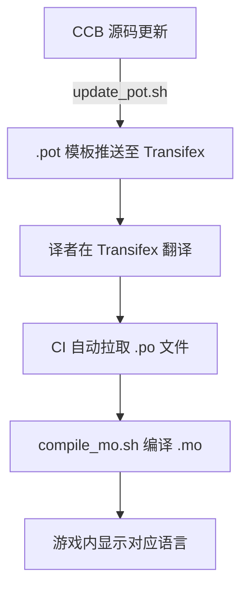

# 翻译贡献

CCB 在 CDDA 基础上做多语言本地化。**不需要会写代码**，只要懂中文和想翻译的目标语言，就可以帮忙！

## 如何参与（普通人版）

CCB 使用 [Transifex](https://www.transifex.com/) 作为翻译平台，全部在线操作，**不需要下载游戏源码、不需要 GitHub、不需要任何开发工具**。

### 1. 注册 Transifex 账号

打开 [Transifex 注册页](https://www.transifex.com/signup/)，用邮箱注册一个免费账号。

### 2. 加入 CCB 翻译项目

访问 CCB 翻译项目主页：

> **[app.transifex.com/Cataclysm-Cleanwater-Bomb/cataclysm-cleanwater-bomb/dashboard/](https://app.transifex.com/Cataclysm-Cleanwater-Bomb/cataclysm-cleanwater-bomb/dashboard/)**

点击 **"Join team"** 或 **"Help translate"** 按钮，选择你擅长的语言，等待通过审核后即可开始翻译。

### 3. 开始翻译

进入项目后你会看到一个翻译界面：

- **左侧**是英文原文（待翻译的字符串）
- **右侧**是你填写译文的地方
- 界面会显示哪些词条已翻译、哪些待翻译
- 翻译完一条会自动跳转到下一条
- 支持全文搜索和过滤器

### 4. 翻译同步到游戏

你提交的翻译会自动保存，CI 构建时会自动拉取到游戏中，**不需要手动提交 PR**。

---

## 翻译质量与约定

翻译 CDDA 系游戏有些特有的坑，无论什么语言都需注意：

| 要点 | 说明 |
|---|---|
| **占位符不能动** | `%s`、`%d`、`<name>`、`<global_val>` 这类占位符要原样保留 |
| **复数形式** | 英文的 `msgid_plural` 要按目标语言的复数规则填写，中文通常不区分 |
| **术语统一** | 同一术语在全局保持一致译法，建议参考已有翻译 |
| **不要翻译 ID** | `id` 字段是游戏内部标识，只翻译 `name`、`description` 等展示字段 |
| **语气简洁** | 游戏内空间有限，译文尽量简洁、符合目标语言习惯而非直译 |

Transifex 界面会校验格式，格式错误会提示修改。

---

## 翻译管道（开发者参考）



## 本地化文件结构

CCB 的翻译走 gettext 的 `.po` / `.mo` 体系：

| 路径 | 作用 |
|---|---|
| `lang/po/` | `.po` 翻译文件 |
| `lang/mo/` | 编译后的 `.mo`（游戏实际加载） |
| `lang/update_pot.sh` | 从源码和 JSON 提取待翻译字符串 |
| `lang/extract_json_strings.py` | 从 JSON 数据里抽取可翻译文本 |
| `lang/compile_mo.sh` | 把 `.po` 编译成 `.mo` |

## 本地校验

如果你需要在本地验证翻译文件格式：

```bash
cd lang && ./compile_mo.sh        # 编译检查
./discard_invalid_po.sh           # 过滤格式有问题的条目
```

## 报名 / 联系

- **Transifex 项目**：[Cataclysm-Cleanwater-Bomb](https://app.transifex.com/Cataclysm-Cleanwater-Bomb/cataclysm-cleanwater-bomb/dashboard/)
- **QQ 群**：加入[社区](/community)开发贡献群（252513599）
- **Discord**：https://discord.gg/tUG9MFwCqf
