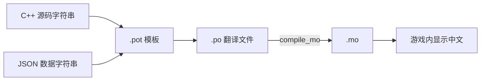

# 翻译贡献

CCB 在 CDDA 基础上做简体中文本地化。如果你懂中英文、愿意校对，可以帮忙改进翻译质量。

:::info[翻译工作流尚在确定中]
CCB 的翻译协作平台与提交方式还未最终敲定。本页先介绍现有的本地化文件结构和通用注意事项，**具体的提交流程会在团队确定后补充**。有意参与的话先到[社区](/community)的开发贡献群报名。
:::

## 本地化文件结构

CCB 的翻译走 gettext 的 `.po` / `.mo` 体系，相关文件和工具都在仓库的 `lang/` 目录：

| 路径 / 工具 | 作用 |
|---|---|
| `lang/po/` | `.po` 翻译文件（源） |
| `lang/mo/` | 编译后的 `.mo`（游戏实际加载） |
| `lang/update_pot.sh` | 从源码和 JSON 提取待翻译字符串，更新 `.pot` 模板 |
| `lang/extract_json_strings.py` | 从 JSON 数据里抽取可翻译文本 |
| `lang/compile_mo.sh` | 把 `.po` 编译成 `.mo` |
| `lang/merge_po.sh` | 合并更新后的模板到现有翻译 |

## 翻译的两类来源



游戏文本来自两处：C++ 源码里的字符串，和 `data/json` 里的物品/怪物/任务等数据。两者都会被提取进翻译模板。

## 注意事项

翻译 CDDA 系游戏有些特有的坑，先了解：

- **占位符不能动**：`%s`、`%d`、`<name>`、`<global_val>` 这类占位符要原样保留，位置可调但不能删改。
- **复数形式**：英文的单复数（`msgid_plural`）要按中文习惯处理，中文通常不区分但格式要对。
- **术语统一**：同一个游戏术语在全局保持一致译法（例如 mutation、CBM、faction 的固定译名）。建议维护一份术语表。
- **语气与简洁**：游戏内空间有限，译文尽量简洁，符合中文表达习惯而非直译。
- **不要翻译 ID**：JSON 里的 `id` 字段是游戏内部标识，永远不翻译；只翻译 `name`、`description` 等展示字段。

## 校验

提交前确保 `.po` 文件格式正确、能成功编译成 `.mo`：

```bash
# 编译检查（不报错即格式正确）
cd lang && ./compile_mo.sh
```

仓库里还有 `discard_invalid_po.sh`、`unicode_check.py` 等校验脚本，可用来排查格式问题。

## 报名参与

翻译流程定下来前，先到[社区](/community)的**开发贡献 QQ 群（252513599）**或 Discord 报名，维护者会同步最新的协作方式。
