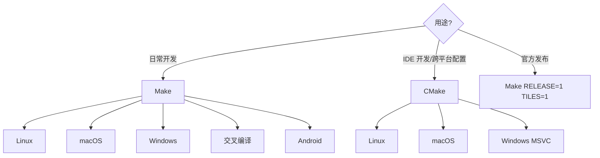

# 编译游戏

CCB 有两个构建系统：**GNU Make**（主要，官方发布用）和 **CMake**（备选，非官方）。推荐使用 Make。

## 构建方式选择



## Make 构建（主构建系统）

Makefile 位于项目根，1648 行，支持多平台和交叉编译。

### 关键 Make 变量

| 变量 | 含义 | 默认 |
|------|------|------|
| `NATIVE=` | 平台：`linux64` `osx` `win32` `emscripten` `android` | 自动检测 |
| `RELEASE=1` | 优化构建（`-O2`/`-O3`） | 否（Debug `-Og`） |
| `TILES=1` | 图形化贴图版（SDL） | 否（curses 终端版） |
| `SDL3=1` | 使用 SDL3（需 `TILES=1`） | 自动启用 |
| `SOUND=1` | 启用音效（需 `TILES=1`） | 否 |
| `LOCALIZE=1` | 多语言支持 | 是 |
| `LANGUAGES=` | 编译的语言，如 `zh_CN zh_TW` | 空 |
| `CLANG=1` | 使用 Clang（默认 GCC） | 否 |
| `CCACHE=1` | 启用 ccache 缓存加速 | 否 |
| `LTO=1` | 链接时优化 | 否 |
| `BACKTRACE=1` | 崩溃时输出调用栈 | 是 |
| `PCH=1` | 预编译头 | 是 |
| `TESTS=1` | 构建单元测试 | 是 |
| `RUNTESTS=1` | 构建并运行测试 | 否 |
| `SANITIZE=address` | 启用 AddressSanitizer | 空 |
| `CROSS=i686-pc-mingw32-` | 交叉编译前缀 | 空 |
| `PREFIX=$DIR` | 安装路径（Linux） | 空 |
| `USE_HOME_DIR=1` | 存档放家目录 | 否 |

### 常用目标

| 目标 | 说明 |
|------|------|
| `all` | 默认：版本号 → 格式化检查 → 编译 → 本地化 → 测试 → zzip |
| `app` / `appclean` | macOS `.app` 包构建/清理 |
| `dmgdist` | macOS `.dmg` 发布包 |
| `bindist` | 生成发布压缩包 |
| `install` | 安装到 `$PREFIX` |
| `clean` / `distclean` | 清理构建 |
| `check` | 构建 + 运行单元测试 |
| `astyle` / `style-json` | 代码/JSON 格式化 |
| `localization` | 编译多语言 `.mo` |
| `version` | 生成 `src/version.h` |

---

## Linux 编译

### 依赖

```bash
# Debian/Ubuntu
sudo apt install build-essential g++ pkg-config \
  libncursesw5-dev gettext ccache \
  libsdl3-dev libsdl3-ttf-dev libsdl3-image-dev \
  libfreetype-dev libharfbuzz-dev

# 或 SDL2
sudo apt install libsdl2-dev libsdl2-ttf-dev libsdl2-image-dev
```

### 终端版（Curses）

```bash
make
```

产物：`./cataclysm`

### 图形版（SDL3，推荐）

```bash
make TILES=1 RELEASE=1 CCACHE=1
```

产物：`./cataclysm-tiles`

### 图形 + 音效

```bash
make TILES=1 SOUND=1 RELEASE=1
```

### 完整开发构建（调试 + 测试 + ccache）

```bash
make CCACHE=1 TESTS=1 LOCALIZE=1
# 产物：./cataclysm-tiles 和 tests/cata_test-tiles
```

:::tip[编译性能优化]

- **ccache**：`CCACHE=1` 二次编译提速 5-10 倍
- **并行度**：默认 `-j$(nproc)` 用完所有核心。内存不足时手动 `-j4` 或 `-j2`
- **大文件**：`character.cpp` 编译需要 1-2GB 内存，并行度太高会 OOM
- **tmpfs 空间**：GCC 中间文件写到 `/tmp`，若 `/tmp` 空间不足设 `TMPDIR=/path/to/large/tmp make ...`
:::

### 交叉编译到 Windows

```bash
# 需安装 mingw-w64
make CROSS=x86_64-w64-mingw32- TILES=1
```

### 交叉编译到 macOS (osxcross)

```bash
make CROSS=x86_64-apple-darwin15- NATIVE=osx CLANG=1 OSXCROSS=1
```

---

## macOS 编译

### 依赖

```bash
# Homebrew
brew install gettext ccache pkg-config

# SDL3（推荐）
brew install sdl3 sdl3_image sdl3_ttf freetype2

# 或 SDL2 Frameworks（发布用）
# 下载 .dmg 安装到 /Library/Frameworks/
```

### 终端版

```bash
make NATIVE=osx
```

### 图形版（SDL3）

```bash
make NATIVE=osx TILES=1 SDL3=1 RELEASE=1
```

### 图形版（SDL2 + Framework）

```bash
# 先安装 SDL2 .framework 到 /Library/Frameworks/
make NATIVE=osx TILES=1 FRAMEWORK=1 RELEASE=1
```

### macOS 应用包

```bash
make NATIVE=osx TILES=1 app     # .app 包
make NATIVE=osx TILES=1 dmgdist  # .dmg 镜像
```

### Universal Binary（x64 + arm64）

```bash
make NATIVE=osx TILES=1 UNIVERSAL_BINARY=1 RELEASE=1 dmgdist
```

---

## Windows 编译

### MSVC + VCPKG（推荐）

参考 `doc/c++/COMPILING-VS-VCPKG.md`。CI 使用此方式。

```powershell
# 需 Visual Studio 2022 + VCPKG
cmake -S . -B build -DCMAKE_BUILD_TYPE=Release -DTILES=ON -DSOUND=ON
cmake --build build --config Release -j
```

### MSYS2

```bash
# 安装依赖
pacman -S mingw-w64-x86_64-gcc mingw-w64-x86_64-SDL2 \
  mingw-w64-x86_64-SDL2_ttf mingw-w64-x86_64-SDL2_image \
  mingw-w64-x86_64-SDL2_mixer

# 构建
make MSYS2=1 TILES=1 RELEASE=1
```

---

## CMake 构建（备选）

:::warning[CMake 构建为非官方，仅供开发使用]
:::

### 基本用法

```bash
# 配置（Release + 贴图 + 音效 + 测试）
cmake -S . -B build \
  -DCMAKE_BUILD_TYPE=Release \
  -DTILES=ON -DSOUND=ON -DTESTS=ON -DLOCALIZE=ON

# 编译
cmake --build build -j4
```

### CMake 选项

| 选项 | 默认 | 说明 |
|------|------|------|
| `TILES` | OFF | 图形贴图版 |
| `CURSES` | ON | 终端版 |
| `SOUND` | OFF | 音效 |
| `BACKTRACE` | ON | 调用栈 |
| `LOCALIZE` | ON | 多语言 |
| `DYNAMIC_LINKING` | ON | 动态链接 |
| `USE_HOME_DIR` | ON | 存档放家目录 |
| `TESTS` | ON | 单元测试 |
| `CATA_CCACHE` | ON | ccache 加速 |
| `USE_SDL3` | 跟 TILES | SDL3 版本 |
| `PRECOMPILE_HEADERS` | ON | 预编译头 |

### 产物

- `build/src/cataclysm-tiles` —— 游戏主程序
- `build/tests/cata_test-tiles` —— 单元测试

---

## 单元测试

```bash
# Make: 构建并运行测试
make check

# CMake: 构建并运行测试
cmake --build build --target check -j4

# 单独运行
tests/cata_test-tiles --min-duration 1.0
```

测试框架为 Catch2，测试文件在 `tests/` 下，与 `src/` 文件一一对应。

---

## 构建常见问题

### 内存不足 (OOM)

```bash
# 减少并行度
make -j2 TILES=1
```

### /tmp 空间不足

```bash
TMPDIR=/home/user/largetmp make TILES=1
```

### macOS sdl2-config not found

需安装 SDL2 的 pkg-config 支持，或使用 Framework 版本：
```bash
make NATIVE=osx TILES=1 FRAMEWORK=1
```

### JSON 未格式化导致编译失败

```bash
make style-json    # 格式化所有 JSON
make json-check    # 检查 JSON 合法性
```

---

下一步：[贡献流程](./contributing)
