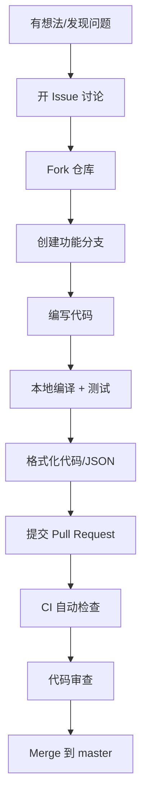
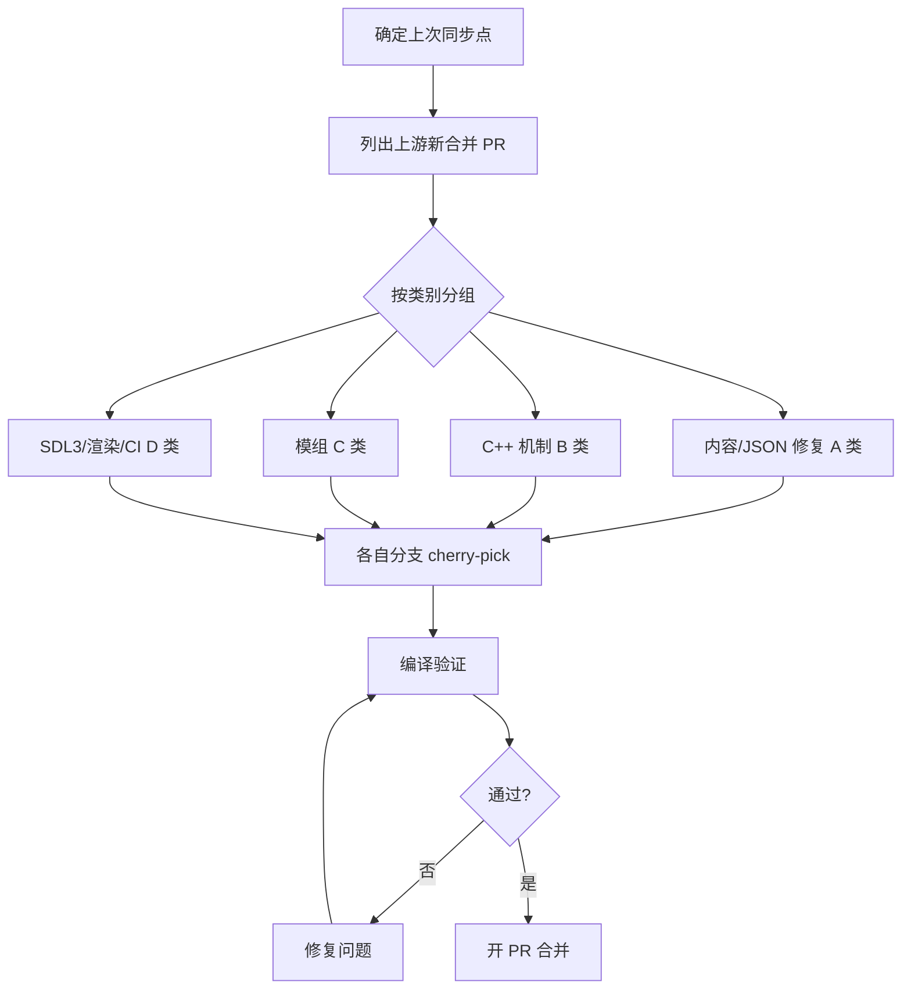

# 贡献流程

## 总览



## 分支命名规范

按内容类别命名：

| 前缀 | 用途 | 示例 |
|------|------|------|
| `fix/` | 修复 bug | `fix-airboat-pilot-legpouch` |
| `feat/` | 新功能 | `feat-vehicle-coloring` |
| `sync/` | 上游同步 | `sync-cdda-cpp-mechanics` |
| `perf/` | 性能优化 | `perf-pixel-minimap-sdl3` |
| `mod/` | 模组 | `mod-xianlu-cultivation` |
| `ci/` | CI/CD | `ci-add-msvc-sdl3` |
| `i18n/` | 翻译 | `i18n-zh-cn-update` |
| `refactor/` | 重构 | `refactor-freetype-singleton` |

## 同步上游 CDDA

CCB 定期从 [CleverRaven/Cataclysm-DDA](https://github.com/CleverRaven/Cataclysm-DDA) 同步已合并的 PR。

### 同步标准流程


```

### cherry-pick 命令参考

```bash
# 添加上游 remote
git remote add upstream https://github.com/CleverRaven/Cataclysm-DDA.git
git fetch upstream

# 对每个同步 PR
git checkout -b sync-cdda-json-fixes
git cherry-pick <上游 commit SHA>

# 有冲突时
# 解决冲突 → git add → git cherry-pick --continue
```

### 上游同步分类

| 类别 | 内容 | 典型文件 |
|------|------|----------|
| A 类 | 内容/JSON 修复 | `data/json/` 物品、配方、地图生成等 |
| B 类 | C++ 机制 | `src/` 游戏逻辑、系统改动 |
| C 类 | 模组 | `data/mods/` Xedra Evolved、Magiclysm 等 |
| D 类 | SDL3/渲染/CI/构建 | 图形、编译系统、CI 工作流 |

### 排除项

以下上游 PR 通常不合入 CCB：
- 纯 macOS dmg 体积优化（冗余）
- 上游文档链接修复（CCB 文档独立）
- 与 CCB 改动的冲突项

---

## PR 规范

### 必须包含 Summary 段

每个 PR 描述 **必须** 包含 `#### Summary` 段，格式如下：

```markdown
#### Summary
CATEGORY: 简短描述改动内容

#### Purpose of change
为什么做这个改动

#### Describe the solution
怎么做的

#### Describe alternatives you've considered
考虑过的其他方案（可选）

#### Testing
测试情况：编译通过 / 功能测试 / 你是否玩过
```

### 类别标签

`CATEGORY` 必须是以下之一：

| 标签 | 含义 |
|------|------|
| `Features` | 新功能 |
| `Content` | 游戏内容（物品、怪物、地图等 JSON 改动） |
| `Interface` | UI 界面改动 |
| `Mods` | 模组改动 |
| `Balance` | 游戏平衡性 |
| `Bugfixes` | Bug 修复 |
| `Performance` | 性能优化 |
| `Infrastructure` | 基础设施/构建系统 |
| `Build` | 编译系统 |
| `I18N` | 国际化/翻译 |
| `None` | 以上都不适用 |

### PR 标题格式

```
CATEGORY: 简短描述

# 示例
fix: 修复飞艇驾驶员腿包放入失败
feat: 新增方向曳光弹效果
perf: 减少像素小地图 SDL3 GPU flush
sync: 同步 CDDA 上游 C++ 机制 (B 类)
```

### 审核要求

- 至少一个 reviewer 同意
- CI 全部通过（matrix + clang-tidy + json + astyle）
- 如果是新功能：需有测试
- 如果是数据改动：JSON 格式校验通过

---

## CI/CD 工作流

CCB 有完整的 CI 矩阵，提交 PR 后自动触发：

### 核心编译检查

| 工作流 | 说明 |
|--------|------|
| **matrix.yml** | 6 路矩阵：clang-13/18、gcc-9/14、cmake+SDL2、macOS 15 |
| **sdl3-matrix.yml** | 5 路 SDL3 矩阵：clang、gcc、macOS、MSVC |
| **msvc-full-features.yml** | Windows MSVC 全功能构建 |

### 代码质量检查

| 工作流 | 说明 |
|--------|------|
| **clang-tidy.yml** | 静态分析 |
| **astyle.yml** | C++ 代码风格 |
| **json.yml** | JSON 格式校验 |
| **flake8.yml** | Python lint |
| **codeql-analysis.yml** | 语义分析 |
| **text-changes-analyzer.yml** | 文本变更分析 |

### 发布流水线

| 工作流 | 说明 |
|--------|------|
| **release.yml** | 全平台发布：Linux AppImage / MSVC / macOS / Android / WebAssembly |

---

## 处理合并冲突

```bash
# 场景：你的分支落后 master
git checkout <你的分支>
git rebase origin/master

# 解决冲突后
git add <冲突文件>
git rebase --continue

# 注意：rebase 后需要 force push
git push --force-with-lease origin <你的分支>
```

---

## 编译验证清单

合并前确认：

- [ ] `make CCACHE=1 TILES=1 TESTS=1` 编译通过
- [ ] `make check` 测试通过
- [ ] `make style-json` JSON 格式无误
- [ ] `make astyle-check` C++ 风格检查通过
- [ ] 实际运行游戏验证功能

---

## 代码风格

- **C++**：遵循 `.astylerc` 配置，使用 `make astyle` 自动格式化
- **JSON**：使用 `make style-json` 格式化
- **Python**：`flake8` 检查
- **CMake**：`cmake-format` 格式化

## 编辑器配置

项目根提供：
- `.editorconfig` — 通用编辑器配置
- `.astylerc` — astyle 格式化规则
- `.clang-tidy` — clang-tidy 静态分析规则
- `.flake8` — Python lint 配置
- `Cataclysm-DDA.code-workspace` — VS Code 工作区
- `Cataclysm-DDA.sublime-project` — Sublime Text 项目

## 更多资源

- [上游 CDDA 贡献指南](https://github.com/CleverRaven/Cataclysm-DDA/blob/master/CONTRIBUTING.md)
- [CCB 游戏仓库](https://github.com/LYHGLYTX/Cataclysm-Cleanwater-Bomb)
- [CDDA 开发者文档](https://github.com/CleverRaven/Cataclysm-DDA/tree/master/doc)
- [CCB Discord 社区](https://discord.gg/tUG9MFwCqf)
