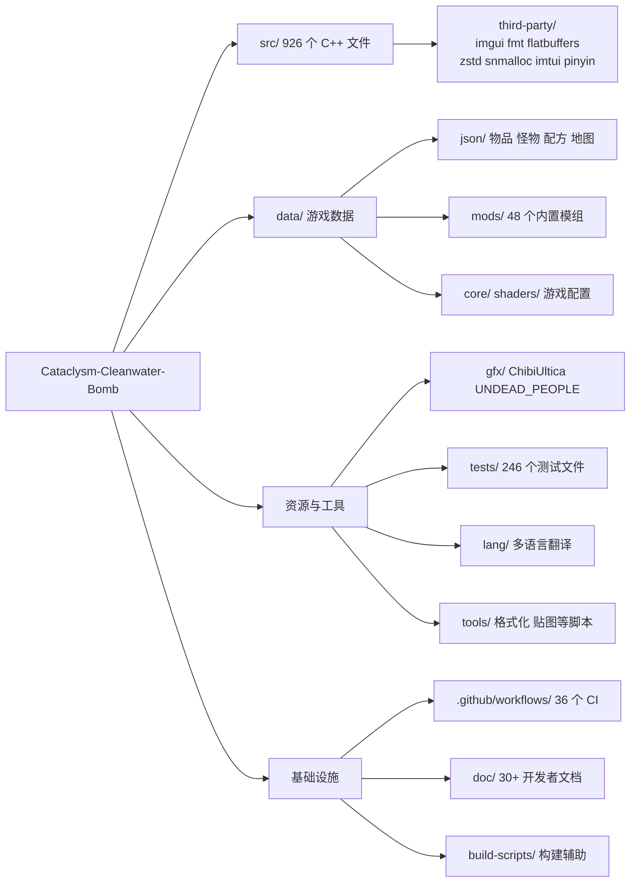
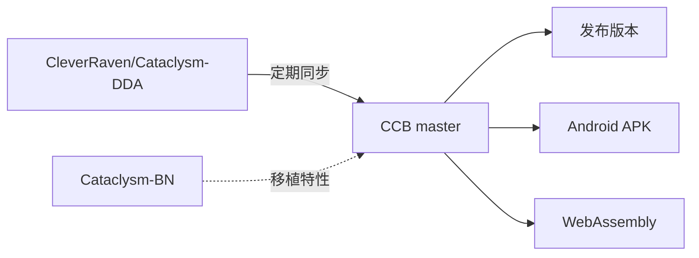

# 开发者教程

面向想要参与 CCB 开发、编译游戏、制作模组或贡献贴图的开发者。

## 技术栈

| 层 | 技术 |
|---|------|
| 语言 | C++17 |
| 构建（主要） | GNU Makefile |
| 构建（备选） | CMake（开发用，非官方发布） |
| 图形 | SDL2 / SDL3 + SDL_image + SDL_ttf |
| 音效 | SDL2_mixer / SDL3_mixer |
| 终端 | ncurses |
| 字体 | FreeType |
| 数据格式 | JSON |
| 存档压缩 | zstd + FlatBuffers |
| 本地化 | gettext + Transifex |
| 单元测试 | Catch2 |
| GUI 框架 | Dear ImGui（调试/开发界面） |
| 代码风格 | astyle（见 `.astylerc`） |

## 项目架构

### 源码目录结构速查

| 前缀/文件 | 子系统 |
|-----------|--------|
| `game.*` `main.cpp` | 游戏主循环、入口 |
| `character.*` `avatar.*` `npc.*` | 玩家/NPC 角色 |
| `monster.*` `monattack.*` `mtype.*` | 怪物系统 |
| `map.*` `mapgen.*` `submap.*` | 地图/格子世界 |
| `overmap.*` `overmapbuffer.*` | 世界地图 |
| `vehicle.*` `veh_type.*` `veh_interact.*` | 载具系统 |
| `item.*` `itype.*` `item_factory.*` | 物品系统 |
| `crafting.*` `recipe.*` | 制作系统 |
| `magic.*` `magic_enchantment.*` | 魔法/附魔系统 |
| `bionics.*` `mutation.*` | 仿生/变异 |
| `savegame.*` `savegame_json.*` | 存档系统 |
| `translation.*` `translations.h` | 翻译系统 |
| `mod_manager.*` `worldfactory.*` | 模组/世界管理 |
| `sdltiles.*` `cata_tiles.*` | SDL 图形后端 |
| `json.*` `flexbuffer_json.*` | JSON 解析器（自研） |
| `math_parser.*` | 数学表达式解析 |
| `effect_on_condition.*` | EOC 效果条件系统 |
| `event_bus.*` `talker.h` | 事件/对话抽象层 |

## 上游关系

CCB 基于 CDDA `master` 分支分叉，定期通过类别分支 cherry-pick 上游 PR 同步。同时从 CBN 选择性移植特性。

## 编辑器建议

CCB 仓库提供：
- **VS Code**: 项目根有 `Cataclysm-DDA.code-workspace` 工作区配置
- **Sublime Text**: 项目根有 `.sublime-project`
- **格式化**: `.astylerc`（C++） + `.flake8`（Python） + `.cmake-format.yml`（CMake）
- **头文件查找**: `make ctags` / `make etags` 生成标签
- **clang-tidy**: `.clang-tidy` 配置文件

## 下一步

- [编译游戏](./build) — 从源码构建 CCB（各平台详细指导）
- [贡献流程](./contributing) — 同步上游、提交 PR 的完整工作流
