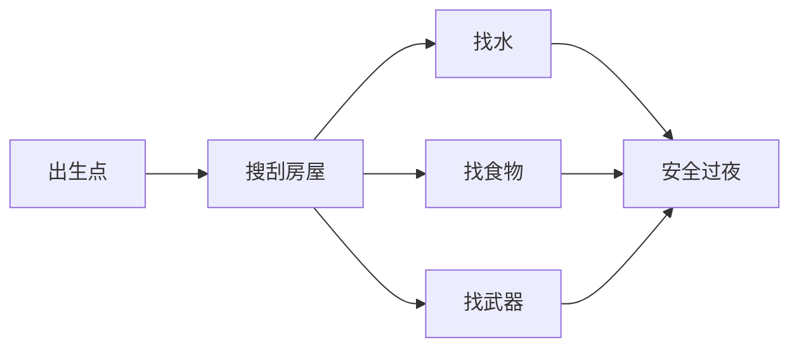

# 活过第一天

第一天的核心目标只有三个：**水、食物、安全**。

## 1. 找水

- 水龙头、热水器、马桶水箱都可能有水
- **生水要烧开**再喝，否则可能生病
- 优先找到一个容器（水壶、瓶子）储水

## 2. 找食物

- 厨房、冰箱、便利店货架
- 注意保质期与腐烂状态
- 罐头是早期最稳的食物来源

## 3. 找安全过夜点

- 远离丧尸聚集区
- 关门、拉窗帘降低被发现概率
- 二楼或封闭房间更安全

## 常见死因与规避

| 死因 | 规避方法 |
|---|---|
| 被群尸围住 | 不要贪刷，遇到多个敌人先撤 |
| 脱水/饥饿 | 第一天就解决水和食物 |
| 流血不止 | 随身带绷带，被咬后及时处理 |

活过第一天后，就可以考虑[建立长期据点](./intro)了。
