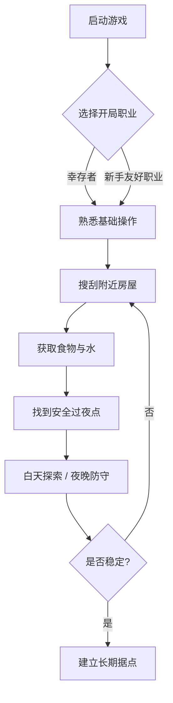

# 新人教程

欢迎来到 **Cataclysm: Cleanwater Bomb (CCB)**。这套教程面向第一次接触本游戏的玩家，带你从零开始活下来。

## 这套教程包含什么

- **[准备开始](./getting-started)** —— 下载、安装、第一次启动游戏
- **[活过第一天](./first-day)** —— 开局选择、基础操作、第一天的生存目标

## CCB 是什么

CCB 是基于 [Cataclysm: Dark Days Ahead (CDDA)](https://github.com/CleverRaven/Cataclysm-DDA) 的一个分支，持续同步上游内容并加入自有特性（载具部件着色、贴图改进、性能优化等）。

## 新手路线图

下面这张图展示了一个典型新手从开局到稳定生存的流程：

> 提示：左侧目录可以跳转到各章节，按 `Ctrl+F` 可在页面内搜索。
