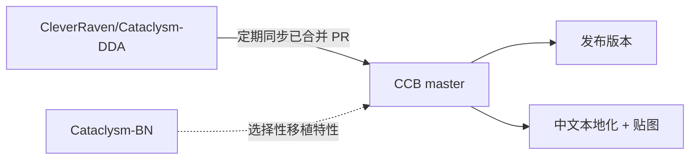

# 开发方向与愿景

:::info
📊 可视化总览请查看 [CCB 开发路线](/roadmap) 页面。
:::

## CCB 是什么

**Cataclysm: Cleanwater Bomb (CCB)** 是基于 [Cataclysm: Dark Days Ahead (CDDA)](https://github.com/CleverRaven/Cataclysm-DDA) 的一个分支。我们持续同步上游的内容与修复，同时加入自有特性，并专注于**简体中文社区**的使用体验。

## 与上游的关系

- **跟随 CDDA**：定期从上游同步内容、机制修复、模组更新，保持与主线接轨。
- **借鉴 BN**：从 Cataclysm-BN 等分支选择性移植受欢迎的特性。
- **自有方向**：在同步之外，做我们认为值得做的改进。

---

## 大体方向

### 1. 上游同步策略

持续跟进 CDDA 上游的合并 PR，按类别分批 cherry-pick：

- **A 类** — 内容 / JSON 修复（物品、配方、地图生成、文本）
- **B 类** — C++ 机制（游戏逻辑、平衡性、AI）
- **C 类** — 模组内容（Xedra Evolved、Magiclysm 等）
- **D 类** — 构建 / CI / 渲染 / 平台支持

**停止点**：当 CCB 自有特性与上游产生不可调和的设计分歧，或维护同步成本超过收益时，将逐步停止主动拉取，转为按需选择性移植。上游同步不是永久策略，是一个阶段性过渡手段。

### 2. 性能优化

CCB 的长期性能目标：让大存档、密集场景、长时间游玩的体验流畅。

| 子方向 | 说明 |
|--------|------|
| **多线程** | 地图加载、路径搜索、怪物 AI 等可并行化的计算移到后台线程，减少主线程阻塞 |
| **渲染优化** | SDL3 渲染管线优化（GPU flush 减少、draw call 合并、sprite batching） |
| **存档加载** | 存档 I/O 异步化，大型存档加载时间优化，增量保存 |
| **内存占用** | 减少冗余数据副本，submap 缓存策略优化，贴图纹理内存管理 |
| **贴图渲染** | 像素小地图性能、生物动画平滑化、瓦片热路径优化 |
| **编译性能** | 预编译头维护、ccache 集成、并行编译优化 |

### 3. NPC 系统

NPC 是末日生存的核心体验，当前 CDDA 的 NPC 系统仍有大量提升空间。

| 子方向 | 说明 |
|--------|------|
| **NPC AI 优化** | 路径搜索、物品挑选、战斗决策的智能化和性能优化 |
| **NPC 交互** | 对话系统扩展，任务多样性，阵营关系动态化 |
| **NPC 基地** | 基地建造与管理、NPC 分工自动化、营地扩展 |
| **NPC 生存** | NPC 自主觅食、医疗、躲避威胁的行为完善 |

### 4. 战斗系统

战斗是游戏最频繁的操作，需要打磨手感和平衡性。

| 子方向 | 说明 |
|--------|------|
| **近战系统** | 武术风格差异化，肢体伤害细化，击退/摔倒/缴械机制 |
| **远程系统** | 瞄准精度计算，弹道模拟，曳光弹效果（已部分落地） |
| **伤害系统** | 伤口系统，流血/感染/骨折的医学仿真 |
| **护甲系统** | 护甲穿透计算，部位防护覆盖，耐久度与修理 |

### 5. 枪械系统

基于现实枪械数据的精细化改造。

| 子方向 | 说明 |
|--------|------|
| **枪械数据** | 基于真实弹道数据的伤害/射程/后座力校准 |
| **配件系统** | 导轨、瞄具、消音器、握把等附件的正确兼容与效果 |
| **弹药系统** | 弹种差异化（穿甲/空尖/曳光），装填机制优化 |
| **枪械手感** | 换弹动画、射击反馈、音效匹配 |

### 6. 宣传与社区

| 子方向 | 说明 |
|--------|------|
| **文档站点** | 维护 ccb-site 文档站，降低新人入门门槛 |
| **视频宣传** | 游戏实况、更新日志视频、新手教程视频 |
| **贴吧 / Reddit** | 定期发布更新公告、招募贡献者 |
| **QQ 社区** | 多群运营（交流 / 开发 / 贴图），新人引导 |
| **Discord** | 国际化社区维护，与 CDDA 社区保持联系 |

---

## 持续任务（不分阶段，永远在做）

| 任务 | 说明 |
|------|------|
| 上游 PR 同步 | 每周跟进 CDDA master，分类 cherry-pick |
| CI 维护 | 保证全平台（Linux/macOS/Windows/Android）构建通过 |
| 贴图补全 | 持续填补 UNDEAD_PEOPLE 缺失贴图 |
| 翻译更新 | 跟进上游新增字符串的简体中文翻译 |
| Bug 修复 | 处理社区反馈的崩溃和逻辑错误 |
| 代码审查 | Review 贡献者的 PR，保持代码质量 |

## 我们的原则

- **稳定优先**：同步上游时编译验证、分批合并，不把破坏性改动直接塞进 master。
- **社区驱动**：方向由社区共同决定，贴图、翻译、内容都欢迎贡献。
- **工具化**：能用工具自动化的协作流程就工具化（如贴图归置），降低参与门槛。

## 参与进来

想推动某个方向？欢迎到[社区](/community)讨论，或直接通过[贡献指南](/docs/contribute/intro)动手。当前在做的具体工作见[工作大纲](./status)。
